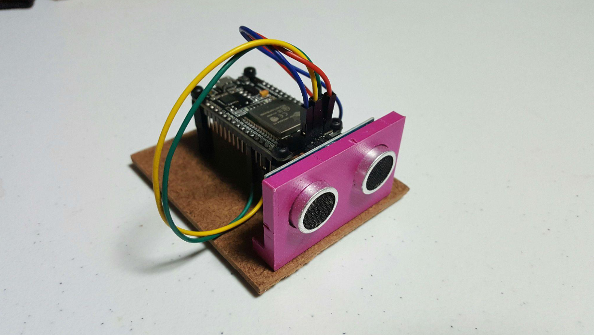
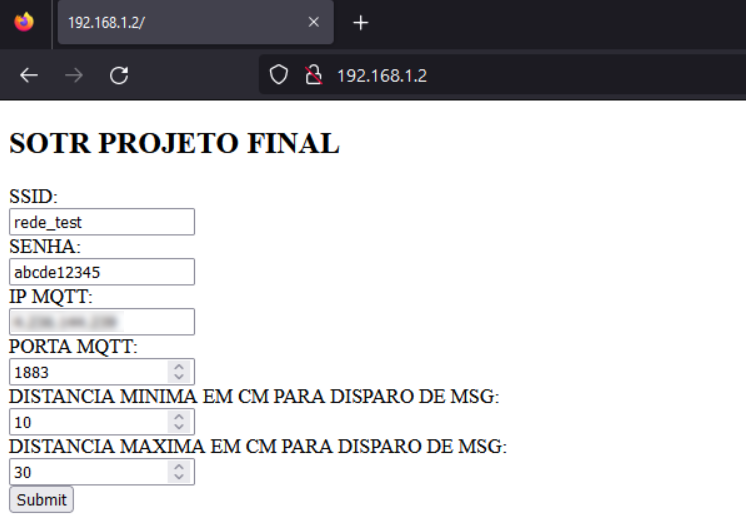
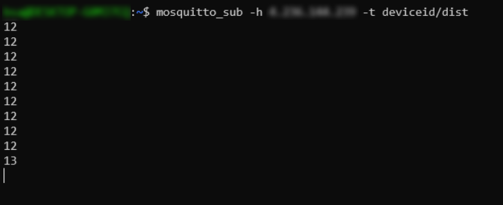

# DISPOSITIVO CONFIGURÁVEL PARA DETECÇÃO DE DISTÂNCIA ATÉ OBJETO
> Dezembro de 2022

# RESUMO

Este texto descreve o processo de arquitetura e execução do projeto final do curso de Sistemas Operacionais em Tempo Real.

Foram utilizados uma placa ESP32 DOIT DevKit V1 e um sensor ultrassônico HC-SR04 para o desenvolvimento de um dispositivo configurável que publica uma mensagem no protocolo MQTT ao detectar um sinal de retorno dentro da distância configurada.

# INTRODUÇÃO

Componentes utilizados:
- 1x ESP32 DOIT DevKit V1
- 1x sensor ultrassônico HC-SR04

Na parte de software, foram utilizados o Espressif IoT Development Framework (ESP-IDF) e bibliotecas integrantes como a lwIP, em conjunto com o sistema operacional em tempo real FreeRTOS.

Como requerimento do projeto, foram utilizados os seguintes recursos do FreeRTOS:
- Tarefas/Tasks (2 ou mais)
- Semáforos
- Filas
- Conectividade com a rede (WiFi ou Bluetooth)

Funcionalidades adicionais do ESP-IDF/FreeRTOS utilizadas nesse projeto incluem:
- Non-volatile Storage (NVS)
- MQTT
- Servidor HTTP
- Event Groups

Não foram utilizadas bibliotecas externas ao ambiente ESP-IDF.

# METODOLOGIA

Os requisitos para o funcionamento do projeto foram separados em dois: a rotina de configuração e a rotina principal.

# ROTINA DE CONFIGURAÇÃO

De maneira similar à biblioteca WifiManager, utilizamos um servidor HTTP para servir localmente uma página HTML onde é possível configurar credenciais de acesso à rede WiFi, credenciais para conexão com servidor MQTT e o intervalo da distância detectada pelo sensor ultrassônico para disparo de mensagem. Para isso, ao detectar ausência de configuração na inicialização do dispositivo, executamos a criação da interface WiFi em modo Access Point (AP), configurando no IP 192.168.1.2 uma rota ao servidor HTTP mencionado anteriormente. Para evitar conflito no SSID da rede WiFi, geramos uma string de caracteres randômicos como parte do nome da rede.

O usuário pode, assim, conectar um dispositivo e navegar ao endereço 192.168.1.2 para iniciar a configuração. Ao clicar no botão de envio, uma mensagem HTTP POST será enviada ao servidor HTTP. Ao receber a mensagem HTTP POST, executamos uma rotina de interpretação que preenche os campos de configuração no NVS para persistência dos dados. Após sucesso da gravação, reiniciamos o dispositivo.

# ROTINA PRINCIPAL

A rotina principal da aplicação é executada quando detectamos a presença de dados de configuração no NVS. De modo simplificado, é uma rotina de três passos: primeiramente inicializamos a interface WiFi em modo station, ou seja, conectamos nosso dispositivo à uma rede WiFi com os dados que obtivemos ao ler o armazenamento não volátil. Ao obtermos um IP, inicializamos um cliente MQTT que conecta-se à um broker com os dados também especificados na configuração.

Partindo do estado de WiFi conectado e IP obtido, começamos a ler a distância pelo sensor ultrassônico. Ao detectar uma distância que respeita as configurações obtidas, inserimos o resultado em uma fila, que é lida pela tarefa de publicação.

O usuário pode utilizar um outro cliente MQTT em um dispositivo diferente para subscrever no tópico "deviceid/dist" e monitorar o dispositivo.

# ARQUITETURA

A aplicação foi dividida em sete tarefas de igual prioridade, controladas principalmente por um Event Group.
- **prvWifiInitTask**: tarefa responsável por checar se o dispositivo já está configurado e iniciar, dependendo do resultado da checagem, a interface WiFi em mode access point (AP) ou station.
- **prvHttpServerTask**: tarefa responsável por iniciar o servidor HTTP que hospeda a página HTML de configuração e recebe e interpreta a mensagem POST com os dados de configuração. Só é chamada caso a interface WiFi esteja inicializada em modo AP.
- **prvMqttInitTask**: tarefa responsável por iniciar um cliente MQTT com as configurações salvas. Só é chamada caso a interface WiFi esteja em modo station e caso tenhamos um IP já atribuído.
- **prvPublishTask**: tarefa responsável por publicar uma mensagem MQTT com a distância lida pelo sensor ultrassônico. Diferentemente das outras, esta tarefa é chamada caso haja alguma mensagem na fila de disparo, que utiliza a API de filas do FreeRTOS.
- **prvDistanceTask**: tarefa responsável por medir a distância em centímetros e decidir se devemos publicar ou não a mensagem MQTT, respeitando as configurações de distância mínima e máxima. Caso a distância esteja no intervalo permitido, inserimos uma mensagem que contém a distância lida na fila de disparo que a tarefa prvPublishTask monitora.
- **prvSaveConfigTask**: tarefa responsável por salvar a configuração recebida via POST em armazenamento não volátil do dispositivo (NVS). Após salvar os dados, reiniciamos o dispositivo.
- **prvResetTask**: tarefa responsável por limpar as configurações do dispositivo, removendo-as do NVS. Diferentemente das outras, esta tarefa é controlada por um semáforo que utiliza a API de semáforos do FreeRTOS. Ao receber uma interrupção causada pelo acionamento do botão na GPIO 0, liberamos o semáforo que permite que essa tarefa seja executada. Após a remoção dos dados, reiniciamos o dispositivo.

# RESULTADOS

Apesar de deixarmos bastante espaço para melhorias como otimização de espaço, gerenciamento de erros e consistência de código, conseguimos replicar em linhas gerais o comportamento de um dispositivo configurável de modo ergonômico pelo usuário.

A natureza assíncrona de uma aplicação baseada em FreeRTOS requer cuidado na ordenação das tarefas: fizemos bastante proveito de ferramentas de controle de fluxo como semáforos, filas e event groups.

# CONCLUSÃO

Com uso consciente das funcionalidades de um sistema operacional em tempo real, é possível tirar ótimo proveito das capacidades de um microcontrolador de modo seguro, consistente e previsível, mesmo ao lidar com grandes stacks tecnológicos como WiFi.
